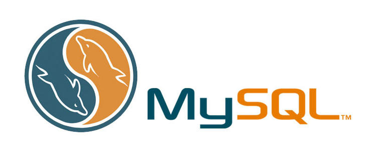

# MySQL成长日志
[心路历程](./Milestone.md)

##SQL 简介
###什么是 SQL？
* SQL 指结构化查询语言
* SQL 使我们有能力访问数据库
* SQL 是一种 ANSI 的标准计算机语言

###SQL 能做什么？
* SQL 面向数据库执行查询
* SQL 可从数据库取回数据
* SQL 可在数据库中插入新的记录
* SQL 可更新数据库中的数据
* SQL 可从数据库删除记录
* SQL 可创建新数据库
* SQL 可在数据库中创建新表
* SQL 可在数据库中创建存储过程
* SQL 可在数据库中创建视图
* SQL 可以设置表、存储过程和视图的权限

###在您的网站中使用 SQL
####要创建发布数据库中数据的网站，您需要以下要素：
* RDBMS 数据库程序（比如 MS Access, SQL Server, MySQL）
* 服务器端脚本语言（比如 PHP 或 ASP）
* SQL
* HTML / CSS
