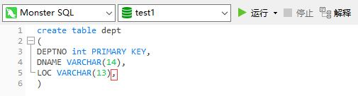
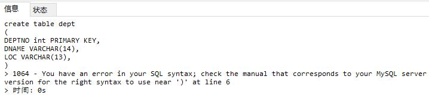
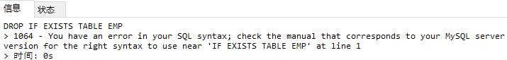

#### case 1
##### eg-a
Error 1064为语法错误，本次报错原因是create table中每列数据描述结尾虽然都要以逗号结尾，但是最后一列的末尾不需要逗号

##### eg-b
再如下图，如有某表则删除的语法，mysql中不存在drop if exists table table_name的做法
正确应当是drop table if exists table_name

