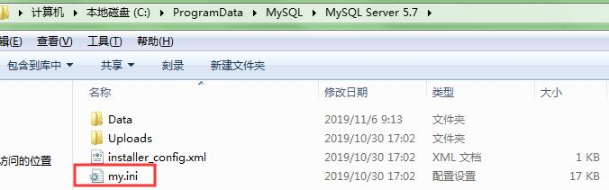

#### case 1 Error 1064
##### eg-a
Error 1064为语法错误，本次报错原因是create table中每列数据描述结尾虽然都要以逗号结尾，但是最后一列的末尾不需要逗号

##### eg-b
再如下图，如有某表则删除的语法，mysql中不存在drop if exists table table_name的做法。
正确应当是drop table if exists table_name

#### case 2 Error 1054 & 1366
##### eg-a Error 1054
Error 1054, unknown column in field list,指的是当前输入的值格式与column设定的值类型不匹配。如下图中，字符串姓名和性别在引用varchar类型时，它们不是纯粹的数字，应当加上单引号。

##### eg-b Error 1366
Error 1366,incorrect string value,是字符串问题，系统以此提示使用的数值字符串不符合表格默认字符串。我们可以用show create table table_name的方式查询建表时的数据，最下方一行能看到表格采用的字符串类型。本示例中表格默认字符串类型为latin1，由于中文的录入需要将字符串改为uef8。

我们找到MySQL的系统配置文件my.ini并修改字符串类型如下。切记，修改前应该net stop mysql服务，否则当前修改无效且可能造成服务器无法连接的问题。修改后再重新启动MySQL服务。另，my.ini本身的编辑格式为ANSI，不要保存成其他格式，否则同样会造成MySQL server无法连接。

