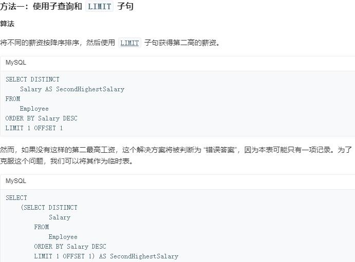

#### LIMIT的用法
##### LIMIT 子句可以被用于强制 SELECT 语句返回指定的记录数。LIMIT 接受一个或两个数字参数。参数必须是一个整数常量。如果给定两个参数，第一个参数指定第一个返回记录行的偏移量，第二个参数指定返回记录行的最大数目。初始记录行的偏移量是 0(而不是 1)： 为了与 PostgreSQL 兼容，MySQL 也支持句法： LIMIT # OFFSET #。
格式：SELECT * FROM table LIMIT [offset,] rows 
##### 这里的offset指的就是偏移量

##### 试题：

方法一解析：
* DISTINCT Salary 表示对SELECT数据结果进行去重
* AS SecondHighestSalary 将数据等同于
* ORDER BY Salary DESC 将数据结果以倒序排列

 

方法二解析：
* IFNULL或者NVL语法格式:IFNULL(数据，返回结果) | NVL(数据，返回结果)。方法二中使用IFNULL返回空值的方法应对题目"如果不存在第二高的薪水，那么查询应返回 null"

 