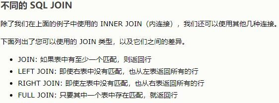
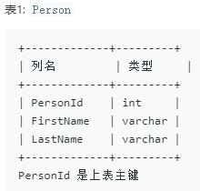
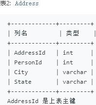

#### Join的用法
##### Join 用于根据两个或多个表中的列之间的关系，从这些表中查询数据。换言之，既是通过Join联结不同表格间的关联数据。
##### 使用Join的前提是，关联的表中有相同的Primary Key。Key的唯一性使得表格间数据能进行有效匹配。

##### 试题：
 

本题考点：表联结Join的使用；陷阱：简单select from的使用

陷阱：
select FirstName, LastName, City, State from Person, Address where Person.PersonId=Address.PersonId
若这4个投影查询中，任何一列存在空值，则会造成查询失败。

正确方法：

SELECT FirstName, LastName, City, State FROM Person LEFT JOIN Address ON Person.PersonId=Address.PersonId

由于LEFT JOIN是指即使右表中没有匹配，也从左表返回所有行。因此即使Address表中存在空值，也依然可以得到查询结果。